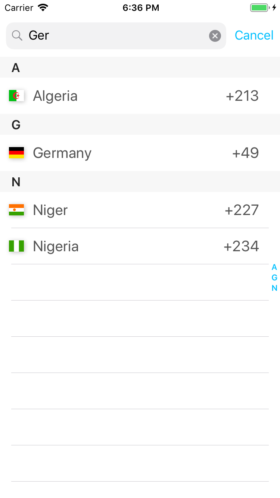
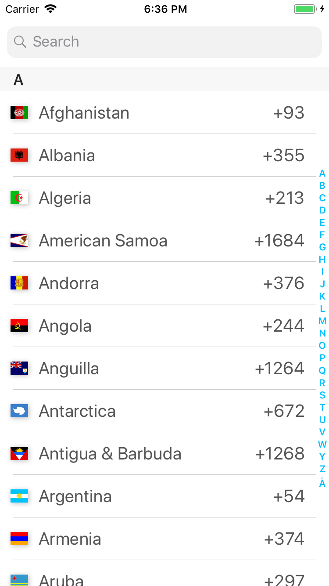
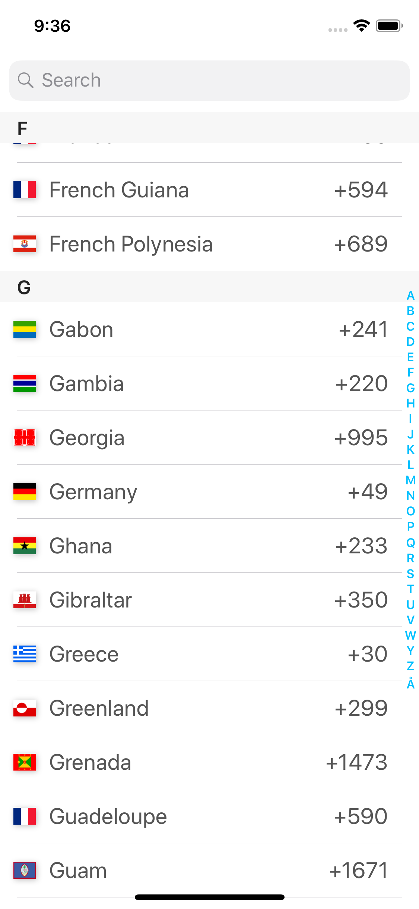

<!-- [](https://github.com/Blackjacx/Columbus/actions/workflows/test.yml) -->
<!-- [](https://swift.org/package-manager/) -->
[](https://twitter.com/intent/follow?original_referer=https%3A%2F%2Fgithub.com%2Fblackjacx&screen_name=Blackjacxxx)
[](https://github.com/Blackjacx/Columbus/releases)
[](https://github.com/Carthage/Carthage)
[](https://swiftpackageindex.com/Blackjacx/Columbus)
[](https://swiftpackageindex.com/Blackjacx/Columbus)
[](https://developer.apple.com/download/)
[](https://developer.apple.com/download/)
[](https://codebeat.co/projects/github-com-blackjacx-columbus-develop)
[](https://github.com/blackjacx/columbus/blob/main/LICENSE)
[](https://www.paypal.me/STHEROLD)

# Columbus

A country picker 🌎 for iOS, tvOS ad watchOS with features you will only find distributed in many different country-picker implementations. 

## Features

- Filter countries using an as-you-type search bar - type the **name** or it's **country code**
- Quickly find a country by using the **index bar** on the right
- Localized by using standard components and Apple's `Locale` class
- Theme support to easily fit to your design
- Storyboard support
- Select a country from the history of selected countries - `still in progress`

## Code Documentation

Find the statically generated code documentation [here](https://blackjacx.github.io/Columbus/documentation/columbus/) (powered by [DocC](https://developer.apple.com/documentation/docc))

## Installation

### Carthage (recommended)

[Carthage](https://github.com/Carthage/Carthage) is a decentralized dependency manager that builds your dependencies and provides you with binary frameworks. To integrate Columbus into your Xcode project using Carthage, specify it in your Cartfile:

```ruby
github "Blackjacx/Columbus"
```

The use the following command to build the XCFramework:

```shell
carthage bootstrap --use-ssh --use-xcframeworks --cache-builds
```

Using Carthage has some advantages in contrast to Cocopods for this framework. Since it needs to compile the asset catalog for over 200 flag assets it is much faster to build the framework once using Carthage and drop it into your app. If you use Cocoapods the asset catalog is compiled together with Columbus each time you do a clean build and probably also when Xcode thinks Columbus needs to be compiled again.

### CocoaPods

To install via [CocoaPods](https://cocoapods.org/pods/Columbus), simply add the following line to your Podfile and run `pod install` to install the newest version:

```ruby
pod "Columbus"
```

## Examples

### Usage

In the following example you'll find all the possible configuration/theming options of Columbus:

```swift
struct CountryPickerConfig: Configurable {

    var displayState = CountryPickerViewController.DisplayState.countryCodeSelection
    /// In this example this has to be a computed property so the font object
    /// is calculated later on demand. Since this object is created right at app
    /// start something related to dynamic type seems not to be ready yet.
    var textAttributes: [NSAttributedString.Key: Any] {
        [
            .foregroundColor: UIColor.text,
            .font: UIFont.preferredFont(forTextStyle: .body)
        ]
    }
    var backgroundColor: UIColor = .background
    var selectionColor: UIColor = .selection
    var controlColor: UIColor = UIColor(red: 1.0 / 255.0, green: 192.0 / 255.0, blue: 1, alpha: 1)
    var lineColor: UIColor = .line
    var lineWidth: CGFloat = 1.0 / UIScreen.main.scale
    var rasterSize: CGFloat = 10.0
    var separatorInsets: UIEdgeInsets {
        UIEdgeInsets(top: 0, left: rasterSize * 4.7, bottom: 0, right: rasterSize * 2.5)
    }
    let searchBarAttributedPlaceholder: NSAttributedString = {
        NSAttributedString(string: "Search",
                           attributes: [
                            .foregroundColor: UIColor.placeholder,
                            .font: UIFont.preferredFont(forTextStyle: .body)])
    }()
}
let countryPicker = CountryPickerViewController(config: CountryPickerConfig(),
                                                initialCountryCode: "US") { (country) in
    print(country)
}
present(countryPicker, animated: true)

```

### Storyboards

Good news for our storyboard users. I implemented full storyboard support. You'll need a fallback for earlier versions. To instantiate the picker from a storyboard you can use the following example:

```swift
let defaultCountry = CountryPickerViewController.defaultCountry(from: "US")
let picker: CountryPickerViewController = storyboard.instantiateViewController(identifier: "Picker") { (coder) -> CountryPickerViewController? in
    return CountryPickerViewController(coder: coder, initialCountryCode: defaultCountry.isoCountryCode) { (country) in
        print(country)
    }
}
```

The above example gives you a non-optional instance of `CountryPickerViewController`. This new syntax also enables us to provide parameters for a storyboard-initialized view (controller). This prevents the addition of optional properties like in previous versions of iOS which is a huge progress.

### iOS

The repository includes an example project. It shows the main use case of the project - the country picker. To run it, just type `pod try Columbus` in your console and it will be downloaded and opened for you. The following set of screenshots highlights the key features unique to Columbus:

Filtering|Index bar|History|Localization|Theming
--- | --- | --- | --- | ---
|||| 


### tvOS
... still in progress ...

### watchOS
... still in progress ...

## Contribution

- If you found a **bug**, please open an **issue**.
- If you have a **feature request**, please open an **issue**.
- If you want to **contribute**, please submit a **pull request**.

## Author

[Stefan Herold](mailto:stefan.herold@gmail.com) • 🐦 [@Blackjacxxx](https://twitter.com/Blackjacxxx)

## Contributors

Thanks to all of you who are part of this:

<a href="https://github.com/blackjacx/Columbus/graphs/contributors">
  
</a>

## Links

- [Modifying UISearchBar Cancel button font text color and style](https://stackoverflow.com/questions/11572372/modifying-uisearchbar-cancel-button-font-text-color-and-style)
- [Localize the cancel button of a UISearchBar](https://stackoverflow.com/questions/12031942/uisearchbar-cancel-button-change-language-of-word-cancel-in-uisearchdisplaycon)

## License

Columbus is available under the MIT license. See the [LICENSE](LICENSE) file for more info.
