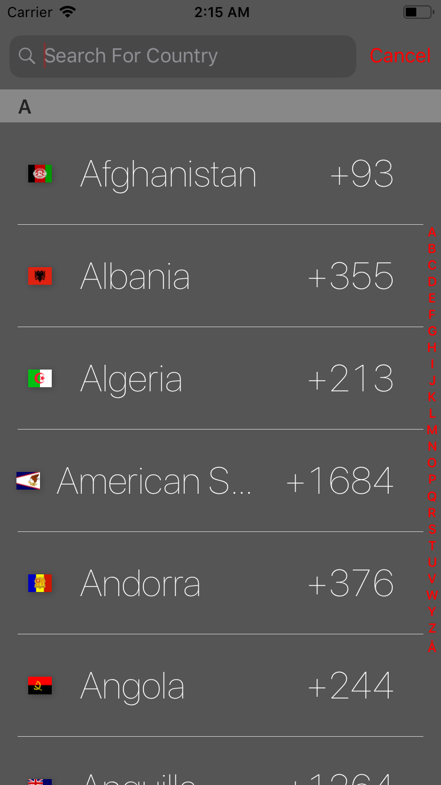

<!-- <p align="center">

</p> -->

<h1 align="center">Columbus</h1>

<p align="center">
  <a href="https://app.bitrise.io/build/ddeb8a6c0cf9a616">
    
  </a>
   
  
  
  
  
  
  
  
  <!-- <a href="https://github.com/Carthage/Carthage">
    
  </a> -->
  <a href="https://github.com/Blackjacx/Columbus/blob/develop/LICENSE?raw=true">
    
  </a>
  <a href="https://codecov.io/gh/Blackjacx/Columbus">
    
  </a>
  <a href="https://codebeat.co/projects/github-com-blackjacx-columbus-develop">
    
  </a>
  <a href="https://cocoapods.org/pods/Columbus">
    
  </a>
  <a href="https://www.paypal.me/STHEROLD">
    
  </a>
</p>

A country picker for iOS, tvOS ad watchOS with features you will only find distributed in many different country-picker implementations. The following list highlights the most valuable features:
- Filter countries by using the searchbar
- Quickly find a country by using the indexbar on the right side
- Select a country from the history of selected countries - `still in progress`
- Localized by using standard components and Apple's `Locale` class
- Theming support to easily match your design

## Installation

### CocoaPods

Columbus is compatible with `iOS 11` and higher and builds with `Xcode 10` and `Swift 4.2`. It is available through [CocoaPods](https://cocoapods.org/pods/Columbus). To install it, simply add the following line to your Podfile and it will install the newest version:

```ruby
pod "Columbus"
```

## Examples

### Usage

```swift
let config = DefaultConfig()
Columbus.config = config

let countryPicker = CountryPickerViewController(initialRegionCode: "DE", didSelectClosure: { [weak self] (country) in
    print(country)
})
present(countryPicker, animated: true)

```

### iOS

The repo includes an example project. It shows the main use case of the project - the country picker. To run it, just type `pod try Columbus` in your console and it will be downloaded and opened for you. The following set of screenshots highlights the features unique to Columbus:

Filtering|Indexbar|History|Localization|Theming
--- | --- | --- | --- | ---
|||| 


### tvOS
... still in progress ...

### watchOS
... still in progress ...

## Contribution

- If you found a **bug**, please open an **issue**.
- If you have a **feature request**, please open an **issue**.
- If you want to **contribute**, please submit a **pull request**.

## Author

[Stefan Herold](mailto:stefan.herold@gmail.com) • [@Blackjacxxx](https://twitter.com/Blackjacxxx)

## Links

[Localize the cancel button of a UISearchBar](https://stackoverflow.com/questions/12031942/uisearchbar-cancel-button-change-language-of-word-cancel-in-uisearchdisplaycon)

## Credits

[Thanks For The Flag Icons](https://github.com/lipis/flag-icon-css)

## License

Columbus is available under the MIT license. See the LICENSE file for more info.
